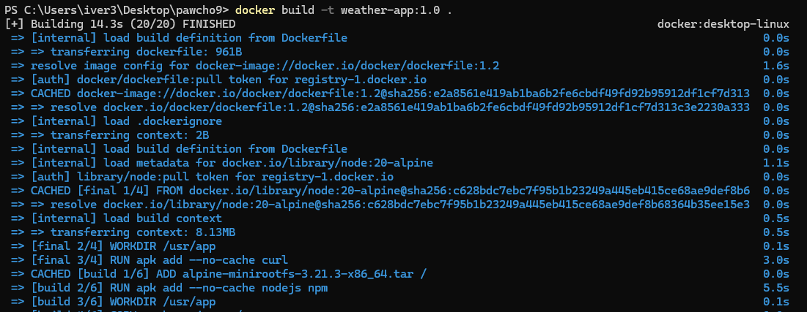
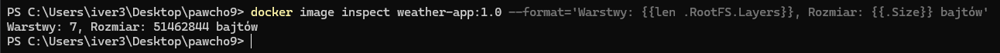
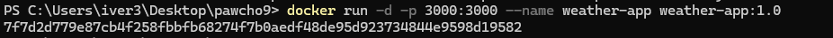
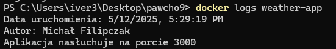
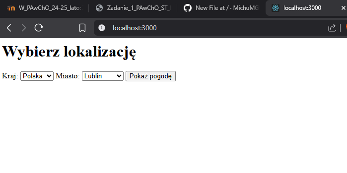
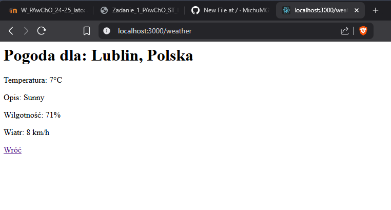

# Programowanie Aplikacji w Chmurze Obliczeniowej - Zadanie 1 (Część obowiązkowa)
### 1. Budowa obrazu
```bash
docker build -t pogoda-app:1.0 .
```


### 2. Sprawdzenie liczby warstw i rozmiaru obrazu
```bash
docker image inspect weather-app:1.0 --format='Warstwy: {{len .RootFS.Layers}}, Rozmiar: {{.Size}} bajtów'
```


### 3. Uruchomienie kontenera
```bash
docker run -d -p 3000:3000 --name weather-app weather-app:1.0
```


### 4. Wyświetlenie logów
```bash
docker logs weather-app
```


### 5. Działanie aplikacji


